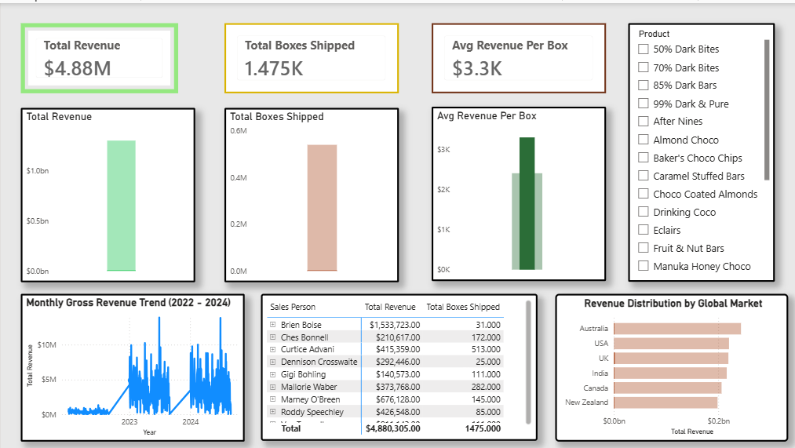
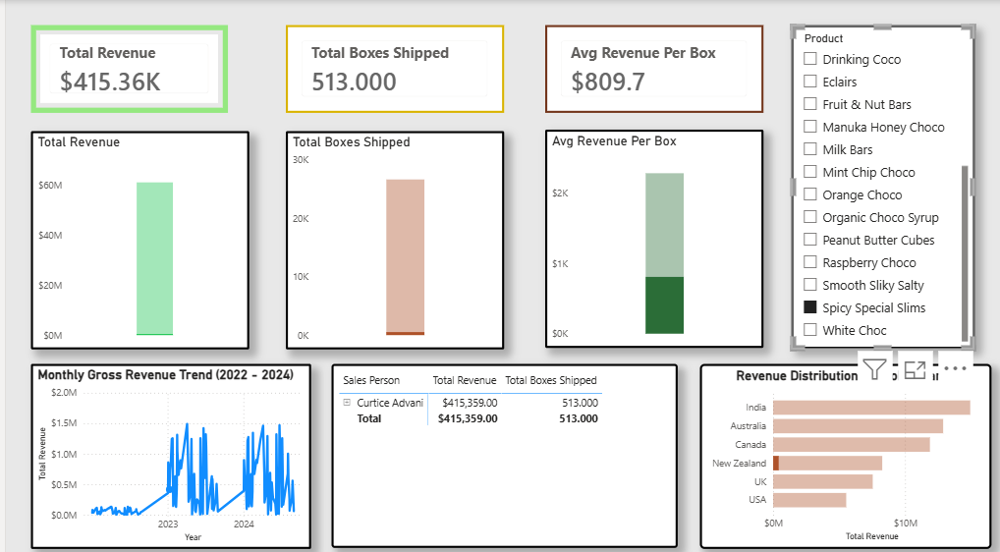
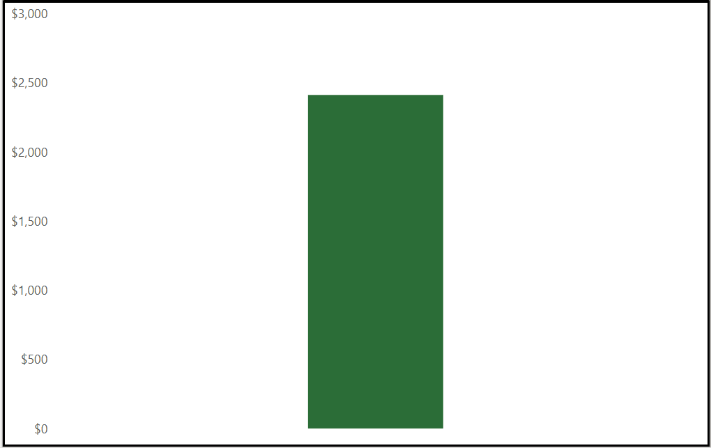

# Chocolate-Sales-Data-Analyst
An executive sales performance dashboard and data analysis project evaluating international chocolate transactions, product profitability, and regional sales trends.

# International Chocolate Sales Performance Dashboard

A comprehensive data analysis and business intelligence project focused on tracking international sales performance, supply chain efficiency, and product profitability for a global chocolate distributor.

# Business Impact & Key Insights
- **Revenue Drivers:** Identified the top-performing chocolate products and regional markets contributing to **[Insert % or total amount]** of total revenue.
- **Profitability Analysis:** Pinpointed low-margin products and optimized sales trends to help stakeholders increase overall profit margins.
- **Efficiency Metrics:** Evaluated transaction frequencies and shipping delivery times to highlight supply chain bottlenecks.

# Tools & Technologies Used
- **Excel / Python (Pandas):** For data cleaning, handling missing values, and engineering date/sales metrics.
- **Power BI / Tableau:** For data modeling, building interactive visuals, and designing an executive-level reporting interface.

# Dashboard Preview
## Dashboard Preview

### 1. Dashboard

### 2.Product Performance

### 3. Chart Close up

# Project Structure
- `chocolate_sales_data.csv`: Cleaned transactional dataset.
- `Chocolate Sales Data Dashboard`: Power BI dashboard file containing data models and interactive sheets.
- `README.md`: Project documentation and executive summary.

# Key Metrics Tracked
1. **Total Sales & Profit Margin:** High-level executive KPIs to monitor financial health.
2. **Sales by Country/Region:** Geospatial analysis to spot underperforming markets.
3. **Product Performance:** Breakdown of top-selling chocolate types versus lagging inventory.
